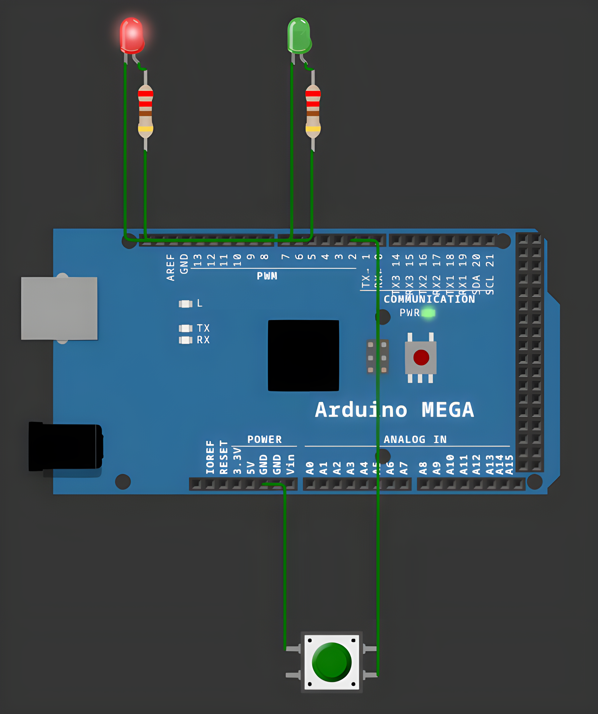

# FreeRTOS Preemptive System

<table align="center">
  <tr>
    <td align="center">
      
    </td>
  </tr>
</table>

## Overview

FreeRTOS Preemptive System is an embedded application for Arduino Mega that demonstrates
preemptive multitasking with FreeRTOS, using a semaphore and a message queue to synchronize
three concurrent tasks triggered by a single button press.

## Features

- **Button-Triggered LED**: Detects a button press, lights a green LED for 1 second, and raises
  a binary semaphore to signal the sync task.
- **Synchronized Counter & Blink**: On each semaphore signal, increments a counter `N`, pushes
  the sequence `1..N` followed by a `0` end marker into a queue, then blinks a red LED `N` times
  (300 ms ON / 500 ms OFF).
- **Asynchronous Queue Reader**: Reads bytes from the queue and prints them over STDIO, starting
  a new line whenever it reads the `0` end marker.
- **Producer-Consumer Communication**: Tasks communicate safely through a FreeRTOS semaphore and
  queue instead of shared global state.
- **Clean Architecture**: Button and LED drivers, and each FreeRTOS task, are separated into
  dedicated components for readability and reuse.

## Technologies

- **Platform**: Arduino Mega
- **Language**: C++ (Arduino Framework)
- **RTOS**: FreeRTOS (Arduino_FreeRTOS)
- **Build System**: PlatformIO
- **Simulation**: Wokwi
- **Development Tools**: Visual Studio Code + PlatformIO IDE
- **Version Control**: Git, GitHub

## Project Structure

```
src/
├── ed_button/
│   ├── ed_button.cpp
│   └── ed_button.h
├── ed_led/
│   ├── ed_led.cpp
│   └── ed_led.h
├── tasks/
│   ├── task_button_led.cpp
│   ├── task_button_led.h
│   ├── task_sync.cpp
│   ├── task_sync.h
│   ├── task_async.cpp
│   └── task_async.h
└── main.cpp
diagram.json
wokwi.toml
platformio.ini
```

## Pin Mapping

| Component | Pin | Action |
|---|---|---|
| Button | 2 | Triggers the LED and raises the semaphore |
| LED Green | 7 | Lights for 1 second on button press |
| LED Red | 8 | Blinks `N` times after each sync event |

## Resources

- [Wokwi Documentation](https://docs.wokwi.com/)
- [Arduino Debounce Tutorial](https://www.arduino.cc/en/Tutorial/Debounce)
- [Arduino Button Debouncing Techniques](https://deepbluembedded.com/arduino-button-debouncing/)

## Installation

To build and run the application, follow these steps:

1. **Clone this repository:**
```bash
git clone https://github.com/Constantin-Stamate/freertos-preemptive-system
```

2. **Navigate to the project directory:**
```bash
cd freertos-preemptive-system
```

3. **Open the project in VS Code with the PlatformIO extension installed**

4. **Build and upload to the board (or run the Wokwi simulation):**
```bash
pio run --target upload
```

5. **Interact via the button:**
```
Press the button -> lights the green LED for 1s, then blinks the red LED N times
                     and prints the sequence 1..N over Serial
```

## Contributors

**FreeRTOS Preemptive System** was developed as part of the Internet of Things laboratory works.

- GitHub: [Constantin-Stamate](https://github.com/Constantin-Stamate)
- Email: constantinstamate.r@gmail.com